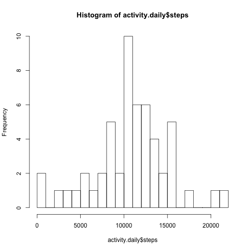

## Loading and preprocessing the data

The data exists in the cloned directory, we get the data from a function:


```r
get.data <- function() {
    zipfile <- "./activity.zip"
    if (! file.exists("./activity.csv")) {
      stopifnot(file.exists(zipfile))
      unzip(zipfile)
    }
    activity <- read.delim(file = "./activity.csv", header = TRUE, sep = ",")
    activity$date <- as.Date(activity$date)
    activity
}

activity <- get.data()
```

In the rest of the code, we use several times the following functions:


```r
remove_na <- function(A) { A[complete.cases(A), ] }

is.weekday <- function(day) {
    weekdays(day) %in% c("Monday", "Tuesday", "Wednesday", "Thursday", "Friday")
}
```


## What is mean total number of steps taken per day?

Since missing values are to be ignored, we start by removing them.
To compute the answer, the number of steps must be grouped by day first and then summed up in each group.


```r
sum_of_steps_by_day <- function(.activity) {
    activity.no.na <- remove_na(.activity)
    activity.daily <- aggregate(x = activity.no.na$steps,
                                by = list(activity.no.na$date),
                                FUN = sum)
    colnames(activity.daily)[colnames(activity.daily)=="Group.1"] <- "date"
    colnames(activity.daily)[colnames(activity.daily)=="x"] <- "steps"
    activity.daily
}
```

To answer, question 1, we must then create the aggregated data set as defined by `sum_of_steps_by_day`,
plot an histogram of it, and compute the mean and median value of the total number of steps per day.
The instructions are all grouped in the following function:


```r
question.1 <- function(.activity) {
    activity.daily <- sum_of_steps_by_day(.activity)
    hist(activity.daily$steps, breaks = 20)
    list(mean=mean(activity.daily$steps),
         median=median(activity.daily$steps))
}
```

Upon calling this function, we obtain the calculations of the mean and median:


```r
question.1(activity)
```



```
## $mean
## [1] 10766.19
## 
## $median
## [1] 10765
```

Again, the reason of creating a function is that this code must be executed twice in the assignment.


## What is the average daily activity pattern?


## Imputing missing values


## Are there differences in activity patterns between weekdays and weekends?
