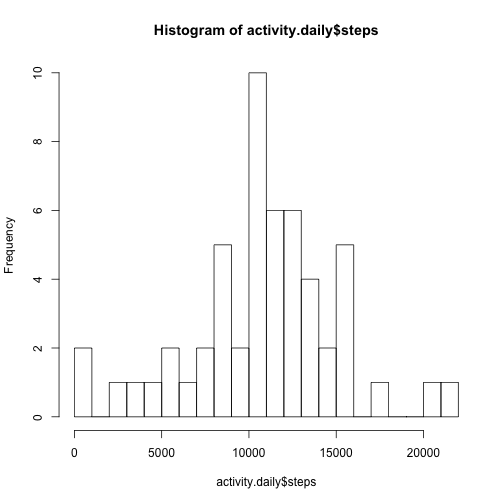

## Loading and preprocessing the data

The data exists in the cloned directory, we get the data from a function:


```r
get.data <- function() {
    zipfile <- "./activity.zip"
    if (! file.exists("./activity.csv")) unzip(zipfile)
    activity <- read.delim(file = "./activity.csv", header = TRUE, sep = ",")
    activity$date <- as.Date(activity$date)
    activity
}

activity <- get.data()
```

In the rest of the code, we use several times the following functions:


```r
remove_na <- function(A) { A[complete.cases(A), ] }

is.weekday <- function(day) {
    weekdays(day) %in% c("Monday", "Tuesday", "Wednesday", "Thursday", "Friday")
}
```


## What is mean total number of steps taken per day?

Since missing values are to be ignored, we start by removing them.
To compute the answer, the number of steps must be grouped by day first and then summed up in each group.


```r
sum_of_steps_by_day <- function(.activity) {
    activity.no.na <- remove_na(.activity)
    activity.daily <- aggregate(x = activity.no.na$steps,
                                by = list(activity.no.na$date),
                                FUN = sum)
    colnames(activity.daily)[colnames(activity.daily)=="Group.1"] <- "date"
    colnames(activity.daily)[colnames(activity.daily)=="x"] <- "steps"
    activity.daily
}
```

To answer Question 1, we must then create the aggregated data set as defined by `sum_of_steps_by_day`,
plot an histogram of it, and compute the mean and median value of the total number of steps per day.
The instructions are all grouped in the following function:


```r
question.1 <- function(.activity) {
    activity.daily <- sum_of_steps_by_day(.activity)
    hist(activity.daily$steps, breaks = 20)
    list(mean=mean(activity.daily$steps),
         median=median(activity.daily$steps))
}
```

Upon calling this function, we obtain the calculations of the mean and median:


```r
question.1(activity)
```


```
## $mean
## [1] 10766.19
## 
## $median
## [1] 10765
```

The mean number of total steps is 10766.19 and the median number of steps is 10765. These numbers are close.


## What is the average daily activity pattern?

In this part, we are grouping by interval ID, and taking the mean value per group.
Here is function doing that (removing NA's):


```r
mean_of_steps_by_interval <- function(.activity) {
    activity.no.na <- remove_na(.activity)
    activity.interval <- aggregate(x = activity.no.na$steps,
                                   by = list(activity.no.na$interval),
                                   FUN = mean)
    colnames(activity.interval)[colnames(activity.interval)=="Group.1"] <- "interval"
    colnames(activity.interval)[colnames(activity.interval)=="x"] <- "steps"
    activity.interval
}
```

To answer Question 2, we must consider the data set returned by the `mean_of_steps_by_interval`
and plot a time series for this dataset to obtain an overview of the evolution of the number of steps
during the day, on average. Also, we need to find the interval with the highest number of steps:
this is the output of the function


```r
question.2 <- function(.activity) {
    activity.interval <- mean_of_steps_by_interval(.activity)
    plot(activity.interval, type="l", xlab="interval", ylab="steps")
    argmax <- which(activity.interval$steps >= max(activity.interval$steps))
    activity.interval[argmax, "interval"]
}
```

Upon calling this function, we obtain the plot
and the interval with the highest average number of steps:


```r
question.2(activity)
```



```
## [1] 835
```


## Imputing missing values


## Are there differences in activity patterns between weekdays and weekends?
